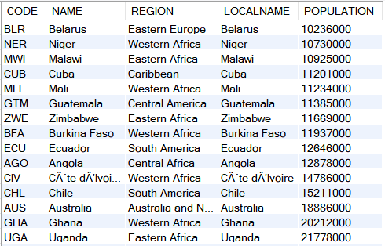

## 1
```
SELECT NAME, REGION, SURFACEAREA, POPULATION
  FROM WORLD.COUNTRY
 ORDER BY SURFACEAREA DESC;
```


## 2
```
SELECT NAME 이름, GNP 국민총생산, GOVERNMENTFORM 정부
  FROM WORLD.COUNTRY
 WHERE GOVERNMENTFORM = 'REPUBLIC'
 ORDER BY GNP ASC;
```


## 3
```
SELECT CODE, NAME, REGION, LOCALNAME, POPULATION
  FROM WORLD.COUNTRY
 WHERE NAME = LOCALNAME AND POPULATION >= 10000000
 ORDER BY POPULATION;
```
